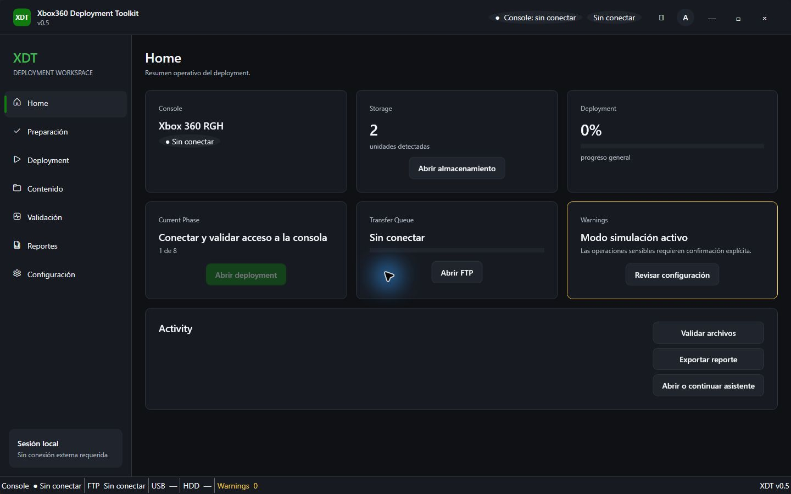
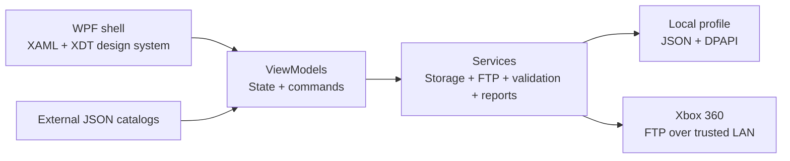

# Xbox360 Deployment Toolkit

[](https://github.com/Balhoo/Xbox360-Deployment-Toolkit/actions/workflows/ci.yml)
[](https://github.com/Balhoo/Xbox360-Deployment-Toolkit/releases)
[](LICENSE)
[](#requirements)

Xbox360 Deployment Toolkit (XDT) is a native Windows workspace for planning, validating and documenting responsible Xbox 360 RGH deployments. It combines guided preparation, storage checks, a persistent checklist, local FTP transfers and portable audit reports in one offline-first WPF application.

This is a portfolio and operational-safety project. **It does not contain or download games, DLC, ROMs, BIOS files, dashboards, firmware or other protected content.** Users provide and remain responsible for every file handled by the toolkit.



## Highlights

- Native **C# + WPF + .NET 8** desktop application.
- Six-step onboarding for console evidence, deployment mode, storage, components and content.
- Persistent preparation and deployment checklists with dependencies, notes and progress.
- Safe local folder scaffolding: no formatting, recursive deletion or mass overwrite operations.
- FTP listing, single-file upload and remote-size verification for Aurora/XeXMenu on a trusted LAN.
- Optional Windows DPAPI credential storage scoped to the current user.
- Declarative JSON catalogs for procedures, preparation items and user-owned content.
- JSON and CSV audit reports that never include credentials.
- Dark/light XDT design system with reusable tokens, controls and interaction states.
- Automated regression tests, Windows CI and tagged self-contained releases.

## Architecture



| Area | Responsibility |
|---|---|
| `Models` | Observable deployment state, catalog entries and audit records |
| `Services` | Drives, FTP, validation, credentials, JSON persistence and reports |
| `ViewModels` | Workflow coordination, commands and safety gates |
| `Presentation/DesignSystem` | Colors, spacing, typography, themes and reusable WPF controls |
| `Configuration` | Editable procedure, preparation, settings and content catalogs |
| `Xbox360DeploymentToolkit.Tests` | Core persistence, validation, reporting and model regression tests |

## Safety model

XDT starts in simulation mode and keeps consequential actions behind explicit destination review and confirmation. It creates only empty local structure and transfers only files selected by the user. Classic FTP is unencrypted, so it should be used only on a private, trusted local network.

The toolkit is not a console modification utility and does not flash NAND, bypass platform protections or supply copyrighted content.

## Requirements

- Windows 10 or Windows 11, x64.
- [.NET 8 SDK](https://dotnet.microsoft.com/download/dotnet/8.0) for source builds.
- PowerShell 5.1 or newer.
- An RGH console with Aurora/XeXMenu FTP is optional and needed only for transfer features.

The tagged release is self-contained and does not require a separate .NET runtime.

## Run from source

```powershell
git clone https://github.com/Balhoo/Xbox360-Deployment-Toolkit.git
cd Xbox360-Deployment-Toolkit
Set-ExecutionPolicy -Scope Process Bypass
.\build.ps1
.\dist\Xbox360DeploymentToolkit.exe
```

Local profiles and encrypted FTP credentials are stored outside the repository:

```text
%LOCALAPPDATA%\Xbox360DeploymentToolkit
```

## Release package

Tagged builds are published on the [Releases page](https://github.com/Balhoo/Xbox360-Deployment-Toolkit/releases). Extract the complete archive and run `Xbox360DeploymentToolkit.exe`; keep the `Configuration` directory beside it so the catalogs remain editable.

The portfolio binary is currently unsigned, so Windows SmartScreen may ask for confirmation. Code signing is planned for a future distribution milestone.

## Test and build

```powershell
dotnet restore .\Xbox360DeploymentToolkit.sln --configfile .\NuGet.Config
dotnet test .\Xbox360DeploymentToolkit.sln --configuration Release --no-restore
dotnet publish .\src\Xbox360DeploymentToolkit\Xbox360DeploymentToolkit.csproj `
  --configuration Release --runtime win-x64 --self-contained true
```

GitHub Actions runs the same validation on every push and pull request to `main`.

## Documentation

- [XDT Design System](docs/XDT-DESIGN-SYSTEM.md)
- [UI architecture](docs/UI-ARCHITECTURE-v2.md)
- [Deployment workflows](docs/DEPLOYMENT-WORKFLOWS-v0.4.md)
- [Security boundaries](docs/SECURITY.md)
- [QA checklist](docs/QA-CHECKLIST.md)
- [Portfolio decisions](docs/PORTFOLIO.md)

## Roadmap

- Hierarchical FTP navigation, cancellation and resumable transfers.
- SHA-256 remote verification when supported by the target server.
- HTML/PDF evidence exports and optional attachment support.
- Signed Windows distribution.

## License

MIT © 2026 Alan Berra.
